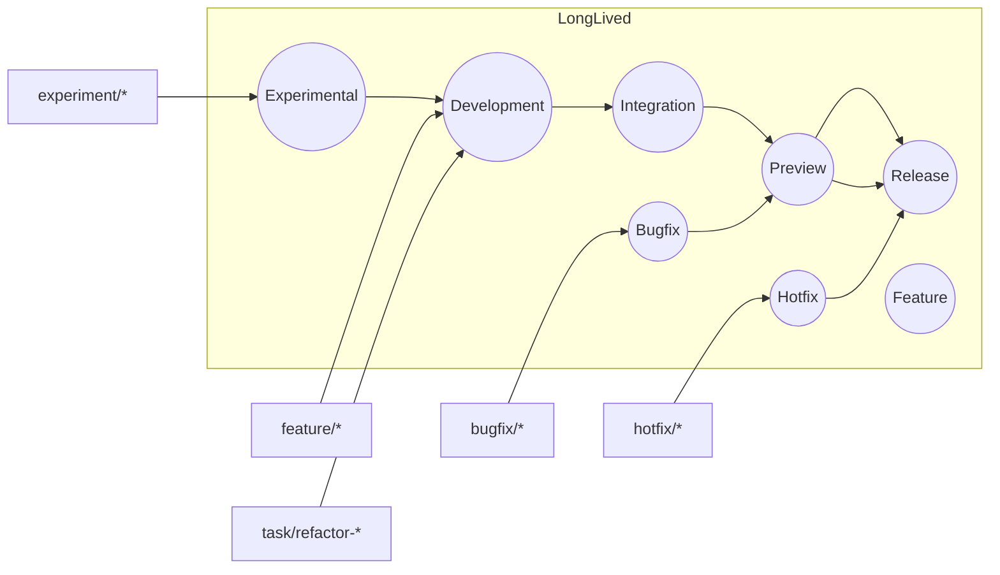

# 📖 GitHub Workflow & Version Control Guide

> **Purpose**  
> This is the canonical, end‑to‑end guide for how we build software: branching, committing, reviewing, testing, releasing, and operating. It applies to **every** repository derived from this template. Keep it consistent, keep it readable, and keep it safe.

---

## 📚 Table of Contents

- [🎯 About This Reference Repository](#-about-this-reference-repository)
  - [Using This Repository as a Template](#using-this-repository-as-a-template)
  - [What You Must Customize After Cloning the Template](#what-you-must-customize-after-cloning-the-template)
- [🌟 Guiding Principles](#-guiding-principles)
- [🛠️ Environment & Technologies](#️-environment--technologies)
  - [Core Technologies](#core-technologies)
  - [Local Development Environment](#local-development-environment)
- [🚀 Project Initialization (Day 0)](#-project-initialization-day0)
  - [Create and Configure Branches](#create-and-configure-branches)
  - [Protect Long‑Lived Branches](#protect-long-lived-branches)
- [🧠 Git Concepts Recap](#-git-concepts-recap)
- [🌿 Branching Strategy & Workflow](#-branching-strategy--workflow)
  - [Branch Roles at a Glance](#branch-roles-at-a-glance)
  - [Temporary Branches (Daily Work)](#temporary-branches-daily-work)
  - [Allowed Merge Paths](#allowed-merge-paths)
  - [Flow of Code (Diagram)](#flow-of-code-diagram)
- [🤖 Artificial Intelligence‑Driven Commit Process](#-artificial-intelligence-driven-commit-process)
  - [Developer Responsibilities (Prompter & Reviewer)](#developer-responsibilities-prompter--reviewer)
  - [Artificial Intelligence Responsibilities (Coder & Scribe)](#artificial-intelligence-responsibilities-coder--scribe)
  - [Conventional Commits (Required)](#conventional-commits-required)
  - [Prompt Template (Optional Helper)](#prompt-template-optional-helper)
- [🤝 Pull Requests & Code Reviews](#-pull-requests--code-reviews)
  - [Pull Request (PR) Author Checklist](#pull-request-pr-author-checklist)
  - [Reviewer Checklist](#reviewer-checklist)
  - [CODEOWNERS & Pull Request (PR) Templates](#codeowners--pull-request-pr-templates)
- [⚙️ Continuous Integration (CI) / Continuous Delivery (CD)](#️-continuous-integration-ci--continuous-delivery-cd)
  - [Example GitHub Actions Workflow](#example-github-actions-workflow)
  - [Preview & Production Environments](#preview--production-environments)
- [🧪 Testing Strategy](#-testing-strategy)
- [🚢 Releases & Versioning](#-releases--versioning)
  - [Semantic Versioning (SemVer)](#semantic-versioning-semver)
  - [Release Procedure](#release-procedure)
  - [Hotfix Procedure](#hotfix-procedure)
- [📦 Dependency Management](#-dependency-management)
- [🔐 Security & Secrets](#-security--secrets)
- [🛡️ Branch Protection (Recommended Settings)](#️-branch-protection-recommended-settings)
- [🧩 Repository Hygiene: Labels, Templates, Hooks](#-repository-hygiene-labels-templates-hooks)
- [🧯 Troubleshooting & Common Scenarios](#-troubleshooting--common-scenarios)
- [⌨️ Git Command Cheat Sheet](#️-git-command-cheat-sheet)
- [📘 Glossary](#-glossary)
- [Appendices](#appendices)
  - [A. Sample `.gitignore` (JavaScript (JS) / Web)](#a-sample-gitignore-javascript-js--web)
  - [B. Sample `CODEOWNERS`](#b-sample-codeowners)
  - [C. Sample Pull Request (PR) Template](#c-sample-pull-request-pr-template)
  - [D. Commitlint (Optional)](#d-commitlint-optional)

---

## 🎯 About This Reference Repository

This repository is a **template and “gold standard”** for new projects. It is not a product itself; it encodes our collaboration and version control practices so every new repository starts healthy.

### Using This Repository as a Template

1. Click **Use this template** → **Create a new repository**.  
2. Choose your organization/account, name the repository, and create it.  
3. GitHub provisions your repository with all files, structure, and settings in this template.

### What You Must Customize After Cloning the Template

- **Update the title** (`# …`) and the opening paragraph of this README.  
- **Adjust the “About” section** (this one) to reflect your project.  
- Everything **below** defines our common process—retain it unless the team explicitly agrees to changes.

---

## 🌟 Guiding Principles

- **`Release` is always production‑ready.** It must be stable, tested, and deployable.
- **No direct commits to long‑lived branches.** All work happens on short‑lived branches and lands via Pull Request (PR).
- **Everything is reviewed.** Pull Request (PR) review is how we share knowledge and maintain quality.
- **Readable history over noisy history.** Prefer small, descriptive commits; squash on merge for long‑lived branches.
- **Clarity everywhere.** Clear branch names, Conventional Commit messages, Pull Request (PR) descriptions, and Continuous Integration (CI) signals.

---

## 🛠️ Environment & Technologies

### Core Technologies

- **Backend: Firebase Studio** ⚡  
  Firestore (Database (DB)), Firebase Authentication (Auth) (users), and Cloud Functions (serverless).  
  <https://firebase.studio/>

- **Front‑End (Web): Firebase Hosting + Domain Name System (DNS) (e.g., Google Domains)** 🌐  
  Build with a modern JavaScript (JS) framework (React / Vue / Svelte) and deploy to Firebase Hosting. Manage custom domains in your Domain Name System (DNS) provider.

- **Artificial Intelligence (AI)** 🤖  
  An Artificial Intelligence (AI) agent assists with code generation and **Conventional Commits** on the correct branch. Humans remain architects, reviewers, testers, and final approvers.

- **Mobile: Flutter or Capacitor** 📱  
  Cross‑platform frameworks for high‑performance iOS/Android from a single codebase.  
  <https://flutter.dev/> · <https://capacitorjs.com/>

### Local Development Environment

- **Node.js**: Latest **Long‑Term Support (LTS)** release required (includes Node Package Manager (npm)).
- **Firebase Command Line Interface (CLI)**:
  ```bash
  npm install -g firebase-tools
  firebase login
  ```
- **Google Cloud Software Development Kit (SDK) (gcloud)**: Recommended for Identity and Access Management (IAM) and Google Cloud Platform (GCP) operations.
- **Visual Studio Code (VS Code)** with:
  - Firebase Extension (rules validation, Firestore support)
  - GitLens
  - ESLint & Prettier
- **Docker** (optional, recommended) for environment parity.
- **Modern Web Framework** (React / Vue / Svelte) as the project dictates.

---

## 🚀 Project Initialization (Day 0)

1. **Create the GitHub repository.** Initialize with `README.md` and the default `main` branch (GitHub default).
2. **Configure Git (first time only).**
   ```bash
   git config --global user.name  "Your Name"
   git config --global user.email "your.email@example.com"
   ```
3. **Clone the repository.**
   ```bash
   git clone https://github.com/<org>/<project>.git
   cd <project>
   ```
4. **Create `.gitignore` early.** Ignore `node_modules/`, build outputs, and `*.env` files.
5. **Install dependencies.**
   ```bash
   npm install
   ```

### Create and Configure Branches

> **Goal:** Establish long‑lived branches with correct ancestry, and set **`Development`** as the **default** branch so nothing updates `Release` automatically.

```bash
# 1) Rename 'main' → 'Release' and push
git branch -m main Release
git push -u origin Release

# 2) Create long‑lived branches from their correct sources

# From Release (production-adjacent)
git switch Release
git switch -c Preview
git push -u origin Preview

git switch Release
git switch -c Bugfix
git push -u origin Bugfix

git switch Release
git switch -c Hotfix
git push -u origin Hotfix

# From the Release line, create Development and its companions
git switch -c Development Release
git push -u origin Development

git switch Development
git switch -c Feature
git push -u origin Feature

git switch Development
git switch -c Integration
git push -u origin Integration

git switch Development
git switch -c Experimental
git push -u origin Experimental

# 3) In GitHub → Settings → Branches, set 'Development' as the default branch.
#    (Keep 'Release' non-default so it only changes via controlled promotions.)
```

### Protect Long‑Lived Branches

In **Settings → Branches → Branch protection rules**, create rules for `Release`, `Preview`, and `Development` (see **Branch Protection** below).

---

## 🧠 Git Concepts Recap

- **Repository (`.git/`)** — full project history and metadata.
- **Working Directory** — your checked‑out files.
- **Staging Area (Index)** — choose exactly what goes into the next commit.
  ```bash
  git add <file>     # stage
  git commit -m "feat: explain staging area with example"
  ```

---

## 🌿 Branching Strategy & Workflow

We separate **long‑lived** stability lines from **short‑lived** task branches.

### Branch Roles at a Glance

| Branch            | Role / Stability                                            | Created From                 | Merges Into | Typical Deploys |
|-------------------|--------------------------------------------------------------|------------------------------|-------------|-----------------|
| `Release`         | **Production** (always deployable)                           | Preview                      | —           | Production      |
| `Preview`         | Quality Assurance (QA) / Staging                             | Development or Integration   | Release     | Staging/Preview |
| `Development`     | Primary integration line                                     | feature/*, task/*, etc.      | Integration / Preview | Development sandbox |
| `Feature`         | Long‑lived base for larger feature streams                   | Development                  | Development | —               |
| `Bugfix`          | Base for non‑critical production fixes (planned patches)     | Release                      | Preview     | Staging         |
| `Hotfix`          | Base for urgent, critical production patches                 | Release                      | Release     | Production      |
| `Integration`     | Aggregation/validation across streams before QA              | Development                  | Preview     | Staging         |
| `Experimental`    | Spikes, prototypes                                           | Development                  | Development | —               |

### Temporary Branches (Daily Work)

- **Naming:** lower‑case with slashes/hyphens →  
  `feature/new-login`, `bugfix/login-error`, `hotfix/checkout-crash`, `task/refactor-auth`, `experiment/rule-evaluator`
- **Create from:**
  - `feature/*` → from `Feature` **or** `Development`
  - `bugfix/*` → from `Bugfix` (which is from `Release`)
  - `hotfix/*` → from `Hotfix` (which is from `Release`)
  - `task/refactor-*` → from `Development`
  - `experiment/*` → from `Experimental`

### Allowed Merge Paths

- `feature/*` → **Development** (via Pull Request (PR))
- `task/*` → **Development** (via Pull Request (PR))
- `experiment/*` → **Experimental** → **Development** (if promoted)
- `bugfix/*` → **Bugfix** → **Preview** → **Release**
- `hotfix/*` → **Hotfix** → **Release** (tag + deploy) → back‑merge to **Development**
- `Development` → **Integration** (as needed) → **Preview** → **Release**

Use **Squash & merge** into long‑lived branches to keep a clean, linear history.

### Flow of Code (Diagram)



---

## 🤖 Artificial Intelligence‑Driven Commit Process

### Developer Responsibilities (Prompter & Reviewer)

- **Specify the task clearly** (acceptance criteria, inputs/outputs, constraints).
- **Review Artificial Intelligence (AI) output** for correctness, security, performance, and style.
- **Run tests locally**; request iterations as needed.
- **Final approval** before opening a Pull Request (PR).

### Artificial Intelligence Responsibilities (Coder & Scribe)

- Generate code per prompt.
- Write **Conventional Commits** messages.
- Commit to the **temporary branch only** (never directly to long‑lived branches).

### Conventional Commits (Required)

**Format:** `type(scope): short summary`  
**Types:** `feat`, `fix`, `docs`, `style`, `refactor`, `perf`, `test`, `build`, `ci`, `chore`, `revert`  
**Footers:** `BREAKING CHANGE: …`, `Closes #123`, `Co-authored-by: …`, `Signed-off-by: …`

```text
feat(auth): add passwordless email-link sign-in

- Implement email-link flow with Firebase Authentication (Auth)
- Add unit tests for token verification
- Update docs with configuration steps

BREAKING CHANGE: removes deprecated useLegacyAuth flag.
Co-authored-by: AI Agent <bot@example.com>
Signed-off-by: Your Name <you@example.com>
```

> **Developer Certificate of Origin (DCO) & Signed Commits**  
> Enable **Require contributors to sign off** and **Require signed commits** on protected branches. Artificial Intelligence (AI) commits should include `Co-authored-by:` and a valid `Signed-off-by:`.

### Prompt Template (Optional Helper)

```text
Goal: <what outcome we need, user story/acceptance criteria>

Scope:
- Inputs:
- Outputs:
- Non-Goals:
- Constraints: (security, performance, compatibility)

Definition of Done:
- [ ] Tests written/passing (unit/integration)
- [ ] Lint passes
- [ ] Docs updated (README/config)
- [ ] Follows code style and Conventional Commits
```

---

## 🤝 Pull Requests & Code Reviews

### Pull Request (PR) Author Checklist

- **Small & focused.** One logical change per Pull Request (PR).
- **Clear description.** Explain the _what_ and _why_. Link issues (`Closes #123`).
- **Proof.** Screenshots/animated images for User Interface (UI); logs for backend changes.
- **Self‑review.** Read **Files changed**, fix nits yourself.
- **Green checks.** Lint/tests pass locally before opening.
- **Security/Secrets.** No Application Programming Interface (API) keys or credentials in the diff.

### Reviewer Checklist

- **Correctness.** Meets requirements; handles edge cases and errors.
- **Readability/Maintainability.** Names, structure, comments.
- **Security.** Input validation, authorization, secrets handling.
- **Performance.** No obvious inefficiencies or N+1 queries.
- **Tests.** Adequate coverage (success and failure paths).
- **Docs.** Updated where behavior/config changed.

### CODEOWNERS & Pull Request (PR) Templates

- Use `CODEOWNERS` to auto‑assign reviewers for paths/areas.
- Provide a Pull Request (PR) template to standardize submissions.  
  See **Appendices** for samples.

---

## ⚙️ Continuous Integration (CI) / Continuous Delivery (CD)

- **Triggers:** every Pull Request (PR) and push to `Development`, `Preview`, or `Release`.
- **Gates:** install, lint, build, unit tests, integration tests.
- **Required:** all checks must pass before merging protected branches.

### Example GitHub Actions Workflow

```yaml
name: CI

on:
  pull_request:
    branches: [Development, Preview, Release]
  push:
    branches: [Development, Preview, Release]

jobs:
  build-and-test:
    runs-on: ubuntu-latest
    steps:
      - uses: actions/checkout@v4
        with: { fetch-depth: 0 }
      - uses: actions/setup-node@v4
        with:
          node-version: 'lts/*'
          cache: 'npm'
      - run: npm ci
      - run: npm run lint --if-present
      - run: npm test -- --ci --reporters=default --coverage

  preview-deploy:
    if: github.event_name == 'push' && github.ref == 'refs/heads/Preview'
    needs: build-and-test
    runs-on: ubuntu-latest
    steps:
      - uses: actions/checkout@v4
      - uses: actions/setup-node@v4
        with: { node-version: 'lts/*' }
      - run: npm ci
      - name: Build and Deploy (Firebase Hosting - Preview)
        env:
          FIREBASE_TOKEN: ${{ secrets.FIREBASE_CI_TOKEN }}
          FIREBASE_PROJECT_ID: ${{ secrets.FIREBASE_PROJECT_ID }}
        run: |
          npm run build
          npx firebase deploy --only hosting --project "$FIREBASE_PROJECT_ID" --non-interactive
```

### Preview & Production Environments

- **Preview:** Auto‑deploy the `Preview` branch after Continuous Integration (CI) passes for stakeholder/Quality Assurance (QA) review.
- **Production:** Deploy from a **tagged commit** on `Release` (see **Releases** below).
- Use **GitHub Environments** with required reviewers and environment secrets.

---

## 🧪 Testing Strategy

- **Unit Tests (foundation):** small, fast, isolated (for example, Jest). Run on every Pull Request (PR).
- **Integration Tests:** components working together (for example, Cloud Functions ↔ Firestore). Run in Continuous Integration (CI).
- **End‑to‑End (E2E) Tests:** critical flows (for example, Cypress). Run against **Preview** when feasible.

**Firebase emulators (local):**
```bash
firebase emulators:start --only firestore,functions,auth
```

**Minimum expectations**
- New logic ships with unit tests.
- Critical flows have integration/End‑to‑End (E2E) coverage.
- Continuous Integration (CI) coverage thresholds enforced (configure in `package.json` or Jest configuration).

---

## 🚢 Releases & Versioning

### Semantic Versioning (SemVer)

`MAJOR.MINOR.PATCH`  
- **MAJOR** — incompatible Programming Interface changes  
- **MINOR** — backwards‑compatible features  
- **PATCH** — backwards‑compatible fixes  
Use pre‑releases (`-rc.1`, `-beta.1`) and optional build metadata (`+build.45`) as needed.

### Release Procedure

1. **Quality Assurance (QA) sign‑off** on `Preview`.
2. **Promote to Release** via Pull Request (PR): `Preview` → `Release` (**Squash & merge**).
3. **Tag an annotated version** on `Release`:
   ```bash
   git switch Release
   git pull --rebase origin Release
   git tag -a v1.0.0 -m "Initial stable release"
   git push origin v1.0.0
   ```
4. **Publish a GitHub Release** with notes (highlights, breaking changes, upgrade steps).
5. **Back‑merge** `Release` into `Development` to keep lines in sync:
   ```bash
   git switch Development
   git merge --no-ff Release
   git push origin Development
   ```

> **First versions:**  
> Internal unstable: start at `0.1.0`. First stable public: `1.0.0`.

### Hotfix Procedure

1. Branch from `Hotfix`: `hotfix/<short-desc>` (base: `Release`).
2. Implement fix → tests → Pull Request (PR) into `Hotfix`.
3. Merge `Hotfix` → `Release`, tag **PATCH** (for example, `1.0.1`), deploy.
4. Back‑merge to `Development` (and `Preview` if necessary).

---

## 📦 Dependency Management

- **Version ranges:**
  - `^1.2.3` → allow **minor & patch** updates
  - `~1.2.3` → allow **patch‑only** updates (**preferred** for production dependencies)
- **Lockfile is mandatory** (`package-lock.json`). Commit it.
- **Reproducible Continuous Integration (CI) installs:** `npm ci`.
- **Upgrades:** small batches; run tests; scan and review changelogs.
  ```bash
  npm outdated
  npm audit
  ```

---

## 🔐 Security & Secrets

- **Never commit secrets.** Keep `.env*` out of Git (in `.gitignore`).
- **Use a secret manager** for non‑local environments (GitHub Secrets, cloud secret manager).
- **Enable repository security features:** secret scanning, Dependabot alerts/updates, code scanning if available.
- **Principle of least privilege** for Continuous Integration (CI) tokens/service accounts.
- **Signed commits & Developer Certificate of Origin (DCO)** on protected branches.

---

## 🛡️ Branch Protection (Recommended Settings)

| Setting                                                | Release | Preview | Development |
|--------------------------------------------------------|:-------:|:-------:|:-----------:|
| Require Pull Requests (PRs) before merging             |   ✅    |   ✅    |     ✅      |
| Required approvals                                     |   2     |  1–2    |     1       |
| Require status checks to pass                          |   ✅    |   ✅    |     ✅      |
| Require CODEOWNERS review                              |   ✅    |   ✅    |     ⬜️      |
| Dismiss stale approvals on new commits                 |   ✅    |   ✅    |     ⬜️      |
| Require signed commits                                 |   ✅    |   ✅    |     ⬜️      |
| Require Developer Certificate of Origin (DCO) sign‑off |   ✅    |   ✅    |     ⬜️      |
| Restrict who can push                                  |   ✅    |   ⬜️    |     ⬜️      |
| Disallow force‑pushes & deletions                      |   ✅    |   ✅    |     ✅      |
| Allow **Squash & merge** only (preferred)              |   ✅    |   ✅    |     ✅      |

> **Default branch:** Set **`Development`** as the **default** branch so `Release` updates only through deliberate promotions.

---

## 🧩 Repository Hygiene: Labels, Templates, Hooks

- **Labels (suggested):**
  - *Type:* `type: feature`, `type: fix`, `type: docs`, `type: chore`
  - *Priority:* `P0`, `P1`, `P2`
  - *Status:* `status: in-progress`, `status: blocked`, `status: needs-review`
- **Issue/Pull Request (PR) templates:** see **Appendices** for samples.
- **Pre‑commit hooks (optional):**
  - Use **Husky** + **lint‑staged** to run `eslint --fix` / `prettier --write` on staged files.

---

## 🧯 Troubleshooting & Common Scenarios

**Committed to the wrong branch**
```bash
git reset --soft HEAD~1
git stash
git switch <correct-branch>
git stash pop
git add -A
git commit -m "fix: move work to correct branch"
```

**Need a single file from another branch**
```bash
git restore --source <other-branch> -- path/to/file.js
# or (legacy)
git checkout <other-branch> -- path/to/file.js
```

**Too many fixup commits → squash**
```bash
git rebase -i HEAD~3
# change 'pick' → 's' (squash) for the last 2 commits, save, write a clean message
```

**Undo a merge with a new revert commit**
```bash
git log --oneline           # find merge commit hash
git revert -m 1 <merge-hash>
```

**Recover a deleted branch**
```bash
git reflog
git switch -c <restored> <commit-hash-from-reflog>
```

**Resolve a simple merge conflict**
```bash
git status
# edit conflicted files to intended state
git add <resolved-file>
git rebase --continue   # or complete the merge as appropriate
```

---

## ⌨️ Git Command Cheat Sheet

### Setup & Init
- `git config --global user.name "Your Name"`
- `git config --global user.email "your.email@example.com"`
- `git clone <url>`
- `git init`

### Daily Flow
- `git status`
- `git add .`
- `git commit -m "type(scope): message"`
- `git pull --rebase origin <branch>`
- `git push origin <branch>`
- `git fetch origin`

### Branching
- `git branch -a`
- `git switch -c <branch>` *(or `git checkout -b <branch>` )*
- `git switch <branch>`     *(or `git checkout <branch>` )*
- `git merge <branch>`
- `git branch -d <branch>`

### History & Diff
- `git log --oneline --graph --decorate`
- `git diff`
- `git diff <branch1>..<branch2>`

### Undo & Advanced
- `git restore --staged <file>`
- `git restore <file>`
- `git commit --amend`
- `git revert <hash>`
- `git stash` / `git stash pop`
- `git cherry-pick <hash>`

---

## 📘 Glossary

- **Artificial Intelligence (AI)** — tooling that writes code and messages under human guidance.  
- **Application Programming Interface (API)** — interface used by software to communicate.  
- **Cloud Functions** — serverless functions in Firebase.  
- **CODEOWNERS** — file mapping code areas to default reviewers.  
- **Continuous Delivery (CD)** — process of delivering built artifacts to environments.  
- **Continuous Integration (CI)** — automated checks on changes.  
- **Developer Certificate of Origin (DCO)** — certification indicated by a `Signed-off-by:` footer.  
- **Domain Name System (DNS)** — naming system for services, e.g., `example.com`.  
- **End‑to‑End (E2E)** — tests that simulate real user journeys across the stack.  
- **Google Cloud Platform (GCP)** — Google’s cloud provider.  
- **Identity and Access Management (IAM)** — role and permission management.  
- **Integrated Development Environment (IDE)** — code editor with tooling, e.g., Visual Studio Code (VS Code).  
- **JavaScript (JS)** — programming language for the web.  
- **Long‑Term Support (LTS)** — stable release line with extended support.  
- **Pull Request (PR)** — change proposal and review workflow in Git hosting.  
- **Quality Assurance (QA)** — validation that software meets requirements.  
- **Semantic Versioning (SemVer)** — version scheme `MAJOR.MINOR.PATCH`.  
- **User Interface (UI)** — visible/interactive parts of the application.

---

## Appendices

### A. Sample `.gitignore` (JavaScript (JS) / Web)
> **What this is:** A `.gitignore` file tells Git which files and directories **not** to track. This prevents machine‑specific artifacts, secrets, build outputs, and dependencies from polluting the repository history.  
> **Use case:** Start with this for JavaScript (JS) and web projects. Place it at the repository root and adapt it for your framework (for example, Next.js, Vite) or additional tooling (for example, Playwright, Cypress). Keeping a strong ignore list protects secrets, speeds up clones, and reduces merge noise.

```gitignore
# dependencies
node_modules/

# builds
dist/
build/
coverage/

# env & local
.env
.env*.local
.firebase/
.firebase-tools.json

# logs
npm-debug.log*
yarn-debug.log*
yarn-error.log*

# editor
.vscode/
.idea/
.DS_Store
```

### B. Sample `CODEOWNERS`
> **What this is:** `CODEOWNERS` is a GitHub‑recognized configuration file that maps file paths to default **owners** (people or teams). When a Pull Request (PR) touches those paths, GitHub automatically requests reviews from the owners.  
> **Use case:** Place this at the repository root (or in `.github/`) to enforce review by subject‑matter owners, reduce review latency, and align with Branch Protection rules that **require code owner reviews**. Customize the path globs and teams to reflect your architecture and responsibilities.

```text
# Default owners
*                  @org/eng-core

# Paths
/docs/**           @org/devrel
/scripts/**        @org/devops
packages/api/**    @org/backend
packages/web/**    @org/frontend
```

### C. Sample Pull Request (PR) Template
> **What this is:** A Pull Request (PR) template pre‑populates the PR body with required sections (summary, screenshots, testing steps, risk/rollout, checklist). It ensures every change includes the context and evidence reviewers need.  
> **Use case:** Save this as `.github/PULL_REQUEST_TEMPLATE.md` (or use multiple templates in `.github/PULL_REQUEST_TEMPLATE/`). GitHub will auto‑apply it when authors open new Pull Requests (PRs), standardizing quality across repositories.

```md
## Summary
<!-- What changed and why -->

## Screenshots / Recordings
<!-- User Interface (UI) changes or important logs -->

## Testing
<!-- Steps for reviewers to verify locally -->

## Risk & Rollout
- [ ] Backward compatible
- [ ] Requires data migration
- [ ] Feature flagged

## Checklist
- [ ] Tests added/updated
- [ ] Documentation updated
- [ ] Conventional Commit Pull Request (PR) title
- [ ] Linked issue: Closes #123
```

### D. Commitlint (Optional)
> **What this is:** Commitlint validates commit messages against a rule set (for example, Conventional Commits) to keep history consistent and machine‑parsable (for example, for automated changelog generation).  
> **Use case:** Add Commitlint and Husky to lint commit messages on the `commit-msg` hook. This is optional but recommended for teams relying on Conventional Commits and release automation.

**`package.json` excerpts**
```json
{
  "scripts": {
    "commitlint": "commitlint --from=HEAD~20 --to=HEAD --verbose",
    "prepare": "husky install"
  },
  "devDependencies": {
    "@commitlint/cli": "^19.0.0",
    "@commitlint/config-conventional": "^19.0.0",
    "husky": "^9.0.0",
    "lint-staged": "^15.0.0"
  }
}
```

**`commitlint.config.cjs`**
```js
module.exports = { extends: ['@commitlint/config-conventional'] };
```

**Husky hook**
```bash
# .husky/commit-msg
npx --no-install commitlint --edit "$1"
```
