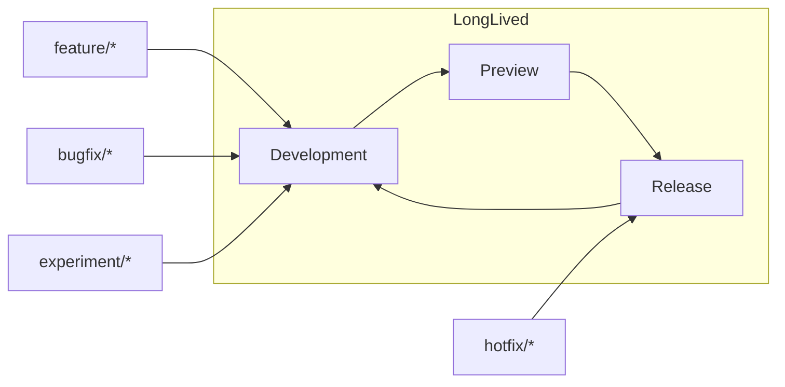

# 🌿 Branching Strategy & Workflow

A clear, enforceable workflow for small branches, high-signal reviews, and safe promotions: **Development → Preview → Release**.

> [!IMPORTANT]
> **Default branch = `Development`.** All work flows through Pull Requests (PRs) with required checks (install → lint → test → build). Never push directly to protected branches (`Development`, `Preview`, `Release`).

> [!CAUTION]
> Hotfixes that target **`Release`** must be *minimal*, reviewed, and immediately **back-merged** to `Development` (and `Preview` if diverged) to keep lines consistent.

---

## 🎯 Goals
- Short-lived topic branches; integrate early into **Development**.
- Continuous Integration (CI) proves safety; Continuous Delivery (CD) promotes with intent.
- Release line remains stable, predictable, and easy to roll back.

---

## 🧱 Branch Types (what they’re for)

| Branch | Purpose | Who writes | How it changes | Deploy target |
|---|---|---|---|---|
| `Development` | Integrate reviewed work daily | Nobody directly (via PR only) | Merge **feature/bugfix/experiment** PRs after checks | Default environment |
| `Preview` | Staging for validation and user acceptance | Nobody directly (via PR only) | **Promoted** from `Development`; critical bugfix PRs allowed | Preview environment |
| `Release` | Production line; tagged versions | Nobody directly (via PR only) | **Promoted** from `Preview`; *emergency* hotfix PRs allowed | Production |
| `feature/*` | New work (feature flags encouraged) | Authors of the feature | Rebase/merge with `Development` until ready; then PR → `Development` | None |
| `bugfix/*` | Fixes for issues discovered pre-release | Authors of the fix | PR → `Development` (or `Preview` if needed) | None |
| `hotfix/*` | Emergency production fixes | Release managers + owners | PR → `Release` (then back-merge) | Production |
| `experiment/*` | Prototypes/spikes | Authors | PR → `Development` (guarded behind flags) | None |

---

## 🔀 Naming & Commit Style

- Branch names:  
  `feature/<topic>`, `bugfix/<ticket>`, `hotfix/<ticket>`, `experiment/<idea>`, `integration/<stream>`.
- Conventional Commits (for readable history & automated notes):  
  `feat(auth): add passwordless sign-in`, `fix(payments): handle webhook retries`, `chore(deps): bump firebase`.

---

## 🧭 Allowed Flows (what can merge where)

| From | To | Allowed? | Notes |
|---|---|:--:|---|
| `feature/*` | `Development` | ✅ | Primary path for new work (via PR) |
| `bugfix/*` | `Development` | ✅ | Usual fix path (via PR) |
| `bugfix/*` | `Preview` | ⚠️ | Only if needed to unblock a release candidate |
| `experiment/*` | `Development` | ✅ | Keep behind feature flags |
| `Development` | `Preview` | ✅ | **Promotion** via PR after checks |
| `Preview` | `Release` | ✅ | **Promotion** with approval; tag after |
| `hotfix/*` | `Release` | ✅ | Emergency only; back-merge required |
| `Release` | `Preview` | 🔁 | Optional back-merge if diverged |
| `Release` | `Development` | 🔁 | **Required** after hotfix or tag |
| `Preview` | `Development` | 🔁 | Back-merge after release as needed |

Legend: ✅ allowed • ⚠️ restricted • 🔁 back-merge

---

## 🗺️ Lifecycle Diagram (high-level)



---

## ✅ Branch Protection (minimums)

| Rule                                             | Development |            Preview            |               Release              |
| ------------------------------------------------ | :---------: | :---------------------------: | :--------------------------------: |
| Require PR before merge                          |      ✅      |               ✅               |                  ✅                 |
| Required status checks (install/lint/test/build) |      ✅      |               ✅               |                  ✅                 |
| Require up-to-date with base                     |      ✅      |               ✅               |                  ✅                 |
| Required reviews                                 |      ≥1     | ≥1 (owners for risky changes) | ≥1 + approval from release manager |
| Restrict pushes (no direct)                      |      ✅      |               ✅               |                  ✅                 |
| Signed commits (optional)                        |      ✅      |               ✅               |                  ✅                 |

> \[!TIP]
> Keep local commands and CI identical to avoid “works on my machine”: `npm ci` → `npm run lint` → `npm test -- --ci` → `npm run build`.

---

## 🚦 Everyday Developer Flow

1. **Start** from `Development`:
   `git switch Development && git pull --ff-only`
2. **Create** a topic branch:
   `git switch -c feature/<topic>`
3. **Commit** with Conventional Commits; push and open a PR → `Development`.
4. **Keep fresh**: rebase on `origin/Development` and `git push --force-with-lease`.
5. **Squash-merge** when green and approved.

---

## 🚢 Promotion & Tagging

1. **Promote** `Development → Preview` (PR with all checks).
2. Perform **Quality Assurance (QA)** and smoke tests on Preview.
3. **Promote** `Preview → Release` (approval required).
4. **Tag** (e.g., `v1.2.0`) and publish release notes generated from Conventional Commits.
5. **Back-merge** `Release → Development` (and `Preview` if it diverged).

---

## 🔧 Hotfix Protocol (production incident)

1. Create `hotfix/<ticket>` from `Release`.
2. Minimal fix; add tests; open PR → `Release`.
3. After merge, **tag patch** (e.g., `v1.2.1`) and **back-merge** into `Development` (and `Preview` if needed).
4. Consider a follow-up `bugfix/` to refactor if the change was rushed.

> \[!CAUTION]
> Don’t batch unrelated fixes in a hotfix PR. Keep scope tiny to minimize blast radius and simplify rollback.

---

## 🧨 Conflict & Divergence Handling

* Prefer **rebase** to keep topic branches linear: `git rebase origin/Development` → fix → `git push --force-with-lease`.
* After release, if `Preview` diverged, **back-merge** from `Release` or re-promote `Development → Preview`.

---

## 🧰 Useful Commands (copy/paste)

```bash
# New feature branch
git switch Development && git pull --ff-only
git switch -c feature/<topic>

# Keep your branch current
git fetch origin
git rebase origin/Development
git push --force-with-lease

# Open PR to Development (via GitHub UI after first push)

# Promote (example: fast-forward via PRs only; shown here as explicit merge)
# Development -> Preview
git switch Preview
git merge --ff-only origin/Development
git push

# Preview -> Release
git switch Release
git merge --ff-only origin/Preview
git push

# Tag the release
git tag v1.2.0 && git push --tags

# Back-merge Release into Development
git switch Development
git merge --no-ff origin/Release
git push
```

---

## 🧪 Quality Gates (what must be green)

* Install via lockfile (`npm ci`)
* Lint (ESLint/Prettier)
* Tests (unit by default; integration/E2E as appropriate)
* Build (production bundle)
* Optional: Secret scanning, Software Composition Analysis (SCA), code scanning

---

## ❓ Frequently Asked Questions (FAQ)

* **Why is `Development` the default branch?**
  Safer integration and simpler PR targeting; promotions make `Release` stable and auditable.

* **When can I merge to `Preview` directly?**
  Rarely—only critical fixes to unblock a release candidate.

* **Do we allow merge commits?**
  For PRs, prefer **squash**. Use merge commits only when preserving the exact history matters.

---

## 🔗 See also
> [!IMPORTANT]
> The links below point to files in /docs/. If you rename or move a file, update every reference across the repo to prevent link drift.

### Introduction
Get set up quickly and understand how this repo is organized and why. This section orients new contributors, aligns everyone on our principles, and ensures your local environment matches what CI expects. By the end, you’ll know the repo layout, standards, and how to make your first safe change.

- [🎯 About This Repository](/README.md)
- [🚀 Project Initialization (Day 0)](/docs/introduction/%F0%9F%9A%80%20Project%20Initialization%20%28Day%200%29.md)
- [🛠️ Environment & Technologies](/docs/introduction/%F0%9F%9B%A0%EF%B8%8F%20Environment%20%26%20Technologies.md)
- [🌟 Guiding Principles](/docs/introduction/%F0%9F%8C%9F%20Guiding%20Principles.md)
- [🧠 GitHub Concepts Recap](/docs/introduction/%F0%9F%A7%A0%20GitHub%20Concepts%20Recap.md)

### Workflow
Show how code moves from idea to production through small, reviewable changes. This is our end-to-end flow: branch naming, commit habits (including AI assist), PR etiquette, CI gates, testing layers, and how we cut and version releases. Follow this to keep changes fast, traceable, and low-risk.

- [🌿 Branching Strategy & Workflow](/docs/distribution/%F0%9F%8C%BF%20Branching%20Strategy%20%26%20Workflow.md)
- [🤝 Pull Requests & Code Reviews](/docs/distribution/%F0%9F%A4%9D%20Pull%20Requests%20%26%20Code%20Reviews.md)
- [⚙️ Continuous Integration & Delivery](/docs/distribution/%E2%9A%99%EF%B8%8F%20Continuous%20Integration%20%26%20Delivery.md)
- [🧪 Testing Strategy](/docs/distribution/%F0%9F%A7%AA%20Testing%20Strategy.md)
- [🚢 Releases & Versioning](/docs/distribution/%F0%9F%9A%A2%20Releases%20%26%20Versioning.md)
- [🤖 AI-Driven Commit Process](/docs/distribution/%F0%9F%A4%96%20AI%E2%80%91Driven%20Commit%20Process.md)

### Operations
Keep the repository healthy over time. These practices harden security (branch protections, secret handling), reduce supply-chain risk (deps), and maintain repo quality (hygiene, troubleshooting). Use these docs when changing guardrails, rotating secrets, upgrading dependencies, or diagnosing issues in production pipelines.

- [🛡️ Branch Protection](/docs/operations/%F0%9F%9B%A1%EF%B8%8F%20Branch%20Protection.md)
- [🔐 Security & Secrets](/docs/operations/%F0%9F%94%90%20Security%20%26%20Secrets.md)
- [📦 Dependency Management](/docs/operations/%F0%9F%93%A6%20Dependency%20Management.md)
- [🧩 Repository Hygiene](/docs/operations/%F0%9F%A7%A9%20Repository%20Hygiene.md)
- [🧯 Troubleshooting](/docs/operations/%F0%9F%A7%AF%20Troubleshooting.md)

### References
Fast lookups you’ll reuse daily—keep these open in a tab. Commands and definitions that support the above processes without re-explaining the “why.” Use this section to unblock yourself quickly while working through Introduction, Workflow, or Operations.

- [⌨️ Git Commands](/docs/references/%E2%8C%A8%EF%B8%8F%20Git%20Commands.md)
- [📘 Glossary](/docs/references/%F0%9F%93%98%20Glossary.md)
