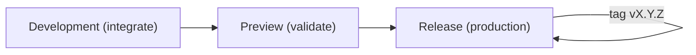

# 🚢 Releases & Versioning

A predictable, low-drama release process with **Semantic Versioning (SemVer)** and clear promotion: **Development → Preview → Release**.

> [!IMPORTANT]
> Expand acronyms on first use (e.g., Semantic Versioning (SemVer), Continuous Integration (CI), Continuous Delivery (CD), Quality Assurance (QA)). **Tag only from `Release`**, and let automation create notes and artifacts.

> [!CAUTION]
> Never hand-edit tags on the server or re-use a tag name. Tags and release artifacts must be **immutable** for auditability and rollback.

---

## 🎯 Goals

- **Consistent versioning** using SemVer: `MAJOR.MINOR.PATCH`.
- **Automated tagging & notes** from Conventional Commits.
- **Intentional promotion** via Pull Requests (PRs): Development → Preview → Release.
- **Fast rollback** using previous tags and reproducible builds.

---

## 🔢 Versioning Policy (SemVer)

| Change type | Conventional Commits cues | Version bump |
|---|---|---|
| **MAJOR** | Any commit with `!` after type (e.g., `feat!`) or a `BREAKING CHANGE:` footer | `X+1.0.0` |
| **MINOR** | At least one `feat(...)` since last tag | `X.Y+1.0` |
| **PATCH** | Only `fix(...)`, `perf(...)`, `refactor(...)`, `docs(...)`, `chore(...)`, `build(...)`, `ci(...)`, `test(...)` | `X.Y.Z+1` |

> [!NOTE]
> Default source of truth is the version in `package.json`. The **Release** workflow reads it and creates a tag `v<version>` if missing.

---

## 🗺️ Release Flow (high-level)



**Lifecycle**

1. PRs merge into **Development** (CI: install → lint → test → build).
2. Promote **Development → Preview**, validate with QA (Quality Assurance) and End-to-End (E2E) smoke tests.
3. Promote **Preview → Release**; **set the version**, then tag and publish.

---

## 🧾 Setting the Version

Choose **one** approach and stick to it:

1. **Manual bump (simple & explicit)**

   * Create a PR to **Preview** (or directly to **Release** as part of the promotion PR) with:

     * `package.json` version set to the target (e.g., `1.4.0`)
     * A conventional commit like: `chore(release): bump version to 1.4.0`
   * After promotion to **Release**, CI tags `v1.4.0` and creates notes.

2. **Auto-derive bump (from commit history)**

   * Use a tool (e.g., Changesets/semantic-release) in **Preview** to compute next version from Conventional Commits.
   * Commit the bump, then promote to **Release** to tag.

> \[!TIP]
> For small repos, manual bump is often clearer. For larger repos, automated derivation reduces toil.

---

## 📝 Release Notes (automated but curated)

* Generated from Conventional Commits and grouped by type:

  * **Features** (`feat`), **Fixes** (`fix`), **Performance** (`perf`), **Refactors**, **Build/CI**, **Docs**, **Tests**
* Include **breaking changes** as a top section with migration notes.
* Add a **human introduction** for context (why this release matters).

**Template (add to the GitHub Release body if needed):**

```md
## Highlights
- ...

## Breaking changes
- ...

## Features
- ...

## Fixes
- ...

## Chore/Build/CI
- ...
```

---

## 🧪 Release Candidates (optional)

For teams needing pre-release tags:

* Tag from **Preview** as `v1.4.0-rc.1`, `v1.4.0-rc.2`, …
* Promote to **Release** with the final `v1.4.0` once QA passes.
* Never deploy an `-rc` tag to production unless policy explicitly allows it.

---

## 🔥 Hotfixes (production incidents)

* Branch `hotfix/<ticket>` from **Release**.
* Minimal, targeted fix + tests → PR to **Release**.
* Merge → tag patch (e.g., `v1.4.1`) → **back-merge** to **Development** (and **Preview** if diverged).
* Document the incident and follow-ups.

> \[!CAUTION]
> Do not batch unrelated changes in a hotfix. Keep scope tiny for safe rollback.

---

## ⏪ Rollback & Re-Deploy

* **Revert the PR** that introduced the issue, or
* **Deploy a previous tag**:

```bash
# Check out the previous good tag
git fetch --tags
git checkout v1.4.0

# (Provider-specific) Re-deploy artifacts for v1.4.0
# e.g., re-run a "deploy by tag" job in your CI/CD
```

Keep build artifacts for recent tags to enable one-click rollbacks.

---

## 🔐 Compliance & Provenance (recommended)

* Keep tags **signed** (developer GPG/SSH) or enforce signed commits.
* Emit **build metadata** (commit SHA, tag, date) into the app/version endpoint.
* If supported, publish **provenance/attestations** for supply-chain visibility.

---

## 🧰 GitHub Actions — Release Workflow (example)

This aligns with the CI/CD document: it reads `package.json` and creates a **tag + GitHub Release** on push to **Release**.

```yaml
name: release
on:
  push:
    branches: [Release]
concurrency:
  group: release-${{ github.ref }}
  cancel-in-progress: true
jobs:
  tag-and-release:
    runs-on: ubuntu-latest
    permissions:
      contents: write
      id-token: write
    environment:
      name: Release
    steps:
      - uses: actions/checkout@v4
        with: { fetch-depth: 0 }
      - uses: actions/setup-node@v4
        with:
          node-version-file: '.nvmrc'
          cache: 'npm'
      - run: npm ci
      - run: npm run build --if-present

      - name: Determine version from package.json
        id: version
        run: echo "value=v$(node -p \"require('./package.json').version\")" >> "$GITHUB_OUTPUT"

      - name: Create tag if missing
        run: |
          git fetch --tags
          if [ -z "$(git tag -l '${{ steps.version.outputs.value }}')" ]; then
            git tag '${{ steps.version.outputs.value }}'
            git push origin '${{ steps.version.outputs.value }}'
          fi

      - name: Generate release notes from commits
        id: notes
        run: |
          echo "body=$(
            git log --pretty=format:'- %s' $(git describe --tags --abbrev=0 --tags --always --match 'v*' --exclude='${{ steps.version.outputs.value }}')..HEAD
          )" >> "$GITHUB_OUTPUT"

      - name: Create GitHub Release
        uses: actions/create-release@v1
        with:
          tag_name: ${{ steps.version.outputs.value }}
          release_name: ${{ steps.version.outputs.value }}
          body: ${{ steps.notes.outputs.body }}
        env:
          GITHUB_TOKEN: ${{ secrets.GITHUB_TOKEN }}
```

> \[!TIP]
> Replace the “Generate release notes” step with your preferred tool (semantic-release, Changesets, or a custom script) for richer grouping and breaking-change sections.

---

## ✅ Release Readiness Checklist

* [ ] **Preview** validated: QA smoke green, metrics acceptable.
* [ ] Version set appropriately (SemVer) and communicated.
* [ ] Migration notes (if any) are in **Breaking changes**.
* [ ] Security scans/Software Composition Analysis (SCA) green.
* [ ] Rollback plan: previous tag installable.
* [ ] Owners available to monitor after release.

---

## ❓ Frequently Asked Questions (FAQ)

* **Where do we bump the version?**
  In `package.json` (source of truth), then CI tags `v<version>` on the **Release** branch.

* **How do Conventional Commits map to SemVer?**
  `BREAKING CHANGE` or `!` ⇒ **MAJOR**, any `feat` ⇒ **MINOR**, otherwise ⇒ **PATCH**.

* **Do docs-only changes cause a release?**
  Up to team policy. If you want docs to skip releases, exclude them from bump logic (e.g., no bump when only `docs` since last tag).

---

## 🔗 See also
> [!IMPORTANT]
> The links below point to files in /docs/. If you rename or move a file, update every reference across the repo to prevent link drift.

### Introduction
Get set up quickly and understand how this repo is organized and why. This section orients new contributors, aligns everyone on our principles, and ensures your local environment matches what CI expects. By the end, you’ll know the repo layout, standards, and how to make your first safe change.

- [🎯 About This Repository](/README.md)
- [🚀 Project Initialization (Day 0)](/docs/introduction/%F0%9F%9A%80%20Project%20Initialization%20%28Day%200%29.md)
- [🛠️ Environment & Technologies](/docs/introduction/%F0%9F%9B%A0%EF%B8%8F%20Environment%20%26%20Technologies.md)
- [🌟 Guiding Principles](/docs/introduction/%F0%9F%8C%9F%20Guiding%20Principles.md)
- [🧠 GitHub Concepts Recap](/docs/introduction/%F0%9F%A7%A0%20GitHub%20Concepts%20Recap.md)

### Workflow
Show how code moves from idea to production through small, reviewable changes. This is our end-to-end flow: branch naming, commit habits (including AI assist), PR etiquette, CI gates, testing layers, and how we cut and version releases. Follow this to keep changes fast, traceable, and low-risk.

- [🌿 Branching Strategy & Workflow](/docs/distribution/%F0%9F%8C%BF%20Branching%20Strategy%20%26%20Workflow.md)
- [🤝 Pull Requests & Code Reviews](/docs/distribution/%F0%9F%A4%9D%20Pull%20Requests%20%26%20Code%20Reviews.md)
- [⚙️ Continuous Integration & Delivery](/docs/distribution/%E2%9A%99%EF%B8%8F%20Continuous%20Integration%20%26%20Delivery.md)
- [🧪 Testing Strategy](/docs/distribution/%F0%9F%A7%AA%20Testing%20Strategy.md)
- [🚢 Releases & Versioning](/docs/distribution/%F0%9F%9A%A2%20Releases%20%26%20Versioning.md)
- [🤖 AI-Driven Commit Process](/docs/distribution/%F0%9F%A4%96%20AI%E2%80%91Driven%20Commit%20Process.md)

### Operations
Keep the repository healthy over time. These practices harden security (branch protections, secret handling), reduce supply-chain risk (deps), and maintain repo quality (hygiene, troubleshooting). Use these docs when changing guardrails, rotating secrets, upgrading dependencies, or diagnosing issues in production pipelines.

- [🛡️ Branch Protection](/docs/operations/%F0%9F%9B%A1%EF%B8%8F%20Branch%20Protection.md)
- [🔐 Security & Secrets](/docs/operations/%F0%9F%94%90%20Security%20%26%20Secrets.md)
- [📦 Dependency Management](/docs/operations/%F0%9F%93%A6%20Dependency%20Management.md)
- [🧩 Repository Hygiene](/docs/operations/%F0%9F%A7%A9%20Repository%20Hygiene.md)
- [🧯 Troubleshooting](/docs/operations/%F0%9F%A7%AF%20Troubleshooting.md)

### References
Fast lookups you’ll reuse daily—keep these open in a tab. Commands and definitions that support the above processes without re-explaining the “why.” Use this section to unblock yourself quickly while working through Introduction, Workflow, or Operations.

- [⌨️ Git Commands](/docs/references/%E2%8C%A8%EF%B8%8F%20Git%20Commands.md)
- [📘 Glossary](/docs/references/%F0%9F%93%98%20Glossary.md)
