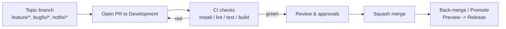

# 🤝 Pull Requests & Code Reviews

A practical guide to creating small, high-quality Pull Requests (PRs) and running efficient, respectful reviews. Default integration goes to **Development**, then promotion to **Preview → Release**.

> [!IMPORTANT]
> **Target branch = `Development`.** Open a Pull Request (PR) from a short-lived topic branch, let Continuous Integration (CI) run (install → lint → test → build), get review, then **squash merge**. Never push directly to protected branches.

> [!CAUTION]
> No secrets in code, screenshots, or logs. Fix any security, secret-scanning, or license alerts before requesting review.

---

## 🎯 Goals
- Keep changes **small and reviewable**; reduce cycle time and risk.
- Ensure changes are **correct, secure, documented, and tested**.
- Make promotion **boring and safe**: Development → Preview → Release.

---

## 🗺️ Pull Request (PR) Lifecycle



---

## ✍️ Author Checklist (before “Request review”)

* **Scope** is single-intent; < \~300 lines changed and ≤10 files (guideline).
* **Local green**: `npm ci` → `npm run lint` → `npm test -- --ci` → `npm run build`.
* **Security**: no secrets; address scanners; least-privilege configs.
* **Docs**: update README/usage or in-repo docs if behavior changes.
* **Tests**: add/adjust unit/integration tests; include QA (Quality Assurance) notes.
* **Description** includes **context, change list, validation, risk/rollback**.
* **Screenshots** (before/after) or clips for UI changes.
* **Title** is human-readable; the **squash commit message** must be Conventional Commits (generate with **GemCommit**).

---

## 🔍 Reviewer Checklist & Rubric

| Area        | What to look for                                                  | Blocking if failing? |
| ----------- | ----------------------------------------------------------------- | :------------------: |
| Correctness | Behavior matches intent; edge cases handled                       |           ✅          |
| Tests       | Adequate unit/integration coverage; pass locally                  |           ✅          |
| Security    | No secrets; safe data handling; least privilege                   |           ✅          |
| Performance | No obvious regressions; reasonable complexity                     |          ⚠️          |
| Readability | Clear names; comments where needed                                |          ⚠️          |
| UX / API    | Backward compatible or migration documented                       |          ⚠️          |
| Docs        | README/help updated; ADR (Architecture Decision Record) if needed |          ⚠️          |

Legend: ✅ = blocking • ⚠️ = may block depending on risk.

---

## 🏷️ Size & Scope Guidelines

* Prefer **3–7 commits** or **one** well-written squash commit at merge time.
* If the PR grows past the guideline, **split**: feature, refactor, test, or docs follow-ups.
* Use **Draft** state for early feedback; convert to **Ready for review** when checks are green.

---

## 💬 Comment Types (use consistently)

* **\[BLOCKER]** — must address before approval.
* **\[SUGGESTION]** — non-blocking improvement.
* **\[QUESTION]** — clarification needed; may unblock with an answer.
* **\[NIT]** — tiny style/readability tweak.

> \[!TIP]
> Prefer actionable suggestions (inline code suggestions where possible). Be specific and assume good intent.

---

## 🧪 Tests & Evidence (what to include)

* **Unit tests** for new logic and bug fixes.
* **Integration or end-to-end (E2E)** tests where behavior spans boundaries.
* **Manual QA** notes: steps, accounts, flags used.
* **Rollout plan**: flags, dark-launch, or gradual exposure if applicable.

---

## 🔐 Security & Compliance

* Validate **secret-scanning** and **Software Composition Analysis (SCA)** results.
* Avoid logging sensitive data; sanitize personally identifiable information (PII).
* Confirm license compatibility for any new dependency and update NOTICE if required.

---

## 🧾 PR Title & Description

* **Title**: short, descriptive, user-impact oriented.
* **Body** (suggested sections):

  * **Context** — why change is needed (link ticket/ADR).
  * **What changed** — bullet list of key edits.
  * **Validation** — tests run, QA done, screenshots.
  * **Risk & rollback** — how to revert/disable (feature flag, revert plan).
  * **Release notes** — one-liner if user facing.

**Example Title**
`Payments: retry webhooks with exponential backoff`

At merge, set the **squash commit message** via **GemCommit** to Conventional Commits:
`fix(payments): 🩹 retry webhooks with exponential backoff`

---

## 🧑‍⚖️ Approvals & Merge Policy

* At least **1 approval** (or per CODEOWNERS) with **all required checks green**.
* **Squash merge** by default; preserve a clean linear history.
* **Back-merge** after hotfix to keep `Development` aligned.
* Use **Update branch** only to bring PR current; prefer `git rebase` on your topic branch with `--force-with-lease`.

---

## ⏱️ Review SLAs (Service Level Agreements)

* **Standard PRs**: first response within **1 business day**.
* **Hotfix PRs**: respond within **2 hours**; reviewers may pair-review or live-review.
* Use **Draft** to signal “not ready”; assign when ready to start the clock.

---

## 🧯 Hotfix PRs (to `Release`)

* Keep change set **minimal**; include targeted tests.
* Require approval from **release manager/owner**.
* After merge/tag, **back-merge** into `Development` (and `Preview` if diverged).
* Document the incident and follow-ups.

---

## 💙 GemCommit at Merge Time

When pressing **Squash and merge**, replace the default message with a **Conventional Commit** generated by **GemCommit** (one emoji, type/scope/summary, concise body). This drives automated **release notes**.

---

## 📎 Minimal PR Template (drop in `.github/pull_request_template.md`)

```md
## Context
Why this change? Link ticket/ADR.

## Changes
- …

## Validation
- Lint/tests/build locally: ✅
- Manual QA notes: …

## Risk & Rollback
- Risk level: low/medium/high
- Rollback: revert PR / disable flag

## Release Notes
One sentence for users/admins.
```

---

## ❓ Frequently Asked Questions (FAQ)

* **Why squash merge?**
  It keeps the main history readable; exploratory commits remain visible in the PR timeline.

* **When should I request changes vs. comment?**
  Use **\[BLOCKER]** for correctness/security issues. Use **\[SUGGESTION]** or **\[NIT]** for polish.

* **Can I merge a large refactor?**
  Prefer a series of safe, incremental PRs with tests over a single massive change.

---

## 🔗 See also
> [!IMPORTANT]
> The links below point to files in /docs/. If you rename or move a file, update every reference across the repo to prevent link drift.

### Introduction
Get set up quickly and understand how this repo is organized and why. This section orients new contributors, aligns everyone on our principles, and ensures your local environment matches what CI expects. By the end, you’ll know the repo layout, standards, and how to make your first safe change.

- [🎯 About This Repository](/README.md)
- [🚀 Project Initialization (Day 0)](/docs/introduction/%F0%9F%9A%80%20Project%20Initialization%20%28Day%200%29.md)
- [🛠️ Environment & Technologies](/docs/introduction/%F0%9F%9B%A0%EF%B8%8F%20Environment%20%26%20Technologies.md)
- [🌟 Guiding Principles](/docs/introduction/%F0%9F%8C%9F%20Guiding%20Principles.md)
- [🧠 GitHub Concepts Recap](/docs/introduction/%F0%9F%A7%A0%20GitHub%20Concepts%20Recap.md)

### Workflow
Show how code moves from idea to production through small, reviewable changes. This is our end-to-end flow: branch naming, commit habits (including AI assist), PR etiquette, CI gates, testing layers, and how we cut and version releases. Follow this to keep changes fast, traceable, and low-risk.

- [🌿 Branching Strategy & Workflow](/docs/distribution/%F0%9F%8C%BF%20Branching%20Strategy%20%26%20Workflow.md)
- [🤝 Pull Requests & Code Reviews](/docs/distribution/%F0%9F%A4%9D%20Pull%20Requests%20%26%20Code%20Reviews.md)
- [⚙️ Continuous Integration & Delivery](/docs/distribution/%E2%9A%99%EF%B8%8F%20Continuous%20Integration%20%26%20Delivery.md)
- [🧪 Testing Strategy](/docs/distribution/%F0%9F%A7%AA%20Testing%20Strategy.md)
- [🚢 Releases & Versioning](/docs/distribution/%F0%9F%9A%A2%20Releases%20%26%20Versioning.md)
- [🤖 AI-Driven Commit Process](/docs/distribution/%F0%9F%A4%96%20AI%E2%80%91Driven%20Commit%20Process.md)

### Operations
Keep the repository healthy over time. These practices harden security (branch protections, secret handling), reduce supply-chain risk (deps), and maintain repo quality (hygiene, troubleshooting). Use these docs when changing guardrails, rotating secrets, upgrading dependencies, or diagnosing issues in production pipelines.

- [🛡️ Branch Protection](/docs/operations/%F0%9F%9B%A1%EF%B8%8F%20Branch%20Protection.md)
- [🔐 Security & Secrets](/docs/operations/%F0%9F%94%90%20Security%20%26%20Secrets.md)
- [📦 Dependency Management](/docs/operations/%F0%9F%93%A6%20Dependency%20Management.md)
- [🧩 Repository Hygiene](/docs/operations/%F0%9F%A7%A9%20Repository%20Hygiene.md)
- [🧯 Troubleshooting](/docs/operations/%F0%9F%A7%AF%20Troubleshooting.md)

### References
Fast lookups you’ll reuse daily—keep these open in a tab. Commands and definitions that support the above processes without re-explaining the “why.” Use this section to unblock yourself quickly while working through Introduction, Workflow, or Operations.

- [⌨️ Git Commands](/docs/references/%E2%8C%A8%EF%B8%8F%20Git%20Commands.md)
- [📘 Glossary](/docs/references/%F0%9F%93%98%20Glossary.md)
