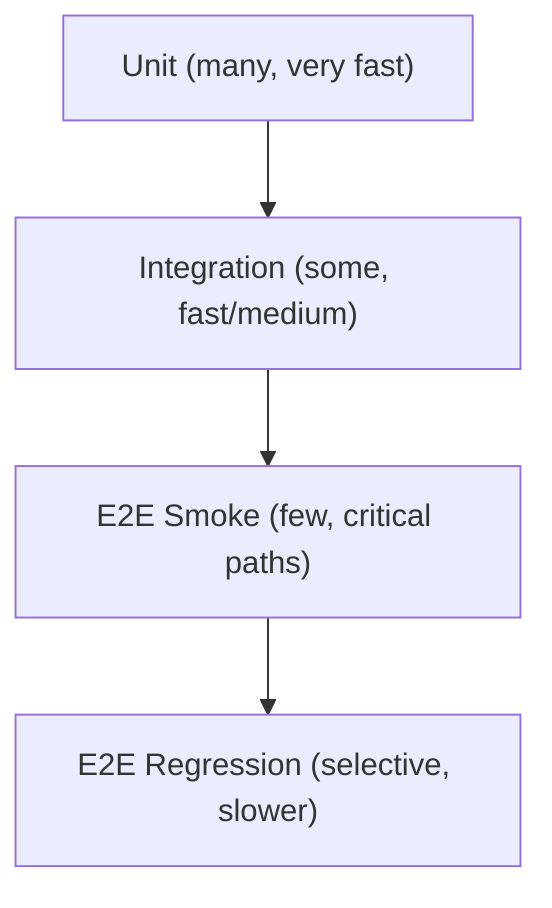

# 🧪 Testing Strategy

A fast, reliable test mix that gives **high signal early** and protects quality at each stage of the pipeline: **Experimental → Development → Preview → Release**.

> [!IMPORTANT]
> Expand acronyms on first use (e.g., Continuous Integration (CI), End-to-End (E2E)). Keep local commands identical to CI: `npm ci` → `npm run lint` → `npm test -- --ci` → `npm run build`.

> [!CAUTION]
> Never use production secrets in tests. Use Firebase Emulators and test-only credentials. Redact sensitive data in logs and artifacts.

---

## 🎯 Objectives

- **Catch defects earliest** on the **Experimental** branch with fast Unit and Integration tests.
- **Gate merges** into **Development** with the same CI checks (install → lint → test → build).
- **Validate real user flows** with End-to-End (E2E) smoke tests on **Preview**, before promoting to **Release**.
- **Stay deterministic**: pinned versions, hermetic environments, seeded data.

---

## 🧱 Test Types & When to Use Them

| Type | Purpose | Scope & Environment | Primary Tools | Speed |
|---|---|---|---|---|
| **Unit** | Prove a function/module behaves as designed | In-process only; mocks for I/O | Vitest/Jest | ⚡ Fast |
| **Integration** | Verify boundaries (HTTP handlers, data layer, rules) | App + **Emulators** (Firestore/Auth/Functions) | Supertest, Firebase Rules Unit Testing, MSW | ⚡/⚠️ Medium |
| **E2E (Smoke)** | Prove critical user journeys | Deployed app (**Preview**) with real browser | Playwright/Cypress | ⚠️ Slower |
| **E2E (Regression)** | Wider coverage for high-risk areas | **Preview** or ephemeral env | Playwright/Cypress | 🐢 Slowest |
| **Contract (Optional)** | Prevent breaking API changes | Consumer/Provider stubs | Pact/Pactflow | ⚠️ Medium |
| **Performance/Accessibility (Optional)** | Performance budgets / a11y checks | Lab checks on **Preview** | Lighthouse/axe | ⚠️ Medium |

> [!TIP]
> Favor **Unit → Integration → targeted E2E**. Keep the “Test Pyramid” steep to preserve speed.

---

## ⛰️ Test Pyramid (concept)



---

## 🗺️ Where Tests Run in the Pipeline

| Stage                          | What runs                                              | Gate                                                            |
| ------------------------------ | ------------------------------------------------------ | --------------------------------------------------------------- |
| **Push/PR → Experimental**     | Unit, Integration (Emulators), Lint, Build             | Must pass to merge to **Experimental** and to proceed with work |
| **Pull Request → Development** | Unit, Integration (Emulators), Lint, Build             | Must pass to merge into **Development**                         |
| **Push → Preview**             | E2E Smoke (critical flows), optional a11y/perf budgets | Must pass to **promote**                                        |
| **Promote → Release**          | (Optional) E2E Regression on candidate, tag + notes    | Must be green to **tag**                                        |

> \[!NOTE]
> **Experimental** is CI-only (no deploy). Use it to de-risk architectural spikes behind feature flags before opening a Pull Request (PR) to **Development**.

---

## 🔧 Tooling & Baseline Config

### Vitest/Jest (Unit/Integration)

`package.json` (excerpt)

```jsonc
{
  "scripts": {
    "test": "vitest run",
    "test:watch": "vitest",
    "test:unit": "vitest run -t unit",
    "test:int": "vitest run -t integration"
  }
}
```

Vitest example (`vitest.config.ts`)

```ts
import { defineConfig } from 'vitest/config';
export default defineConfig({
  test: {
    globals: true,
    coverage: { reporter: ['text', 'lcov'], lines: 80, branches: 75, functions: 80 },
    environment: 'node',
    setupFiles: ['./test/setup.ts']
  }
});
```

### Playwright (E2E)

`playwright.config.ts`

```ts
import { defineConfig, devices } from '@playwright/test';
export default defineConfig({
  timeout: 60_000,
  retries: 1,
  use: {
    baseURL: process.env.PREVIEW_URL || 'http://localhost:5173',
    trace: 'retain-on-failure',
    screenshot: 'only-on-failure',
    video: 'retain-on-failure'
  },
  projects: [{ name: 'chromium', use: { ...devices['Desktop Chrome'] } }]
});
```

---

## 🔌 Firebase Emulators (Integration)

Use emulators to test Firestore rules, Authentication flows, and Cloud Functions locally.

`.env.test.local` (never commit real secrets)

```ini
FIREBASE_AUTH_EMULATOR_HOST=localhost:9099
FIRESTORE_EMULATOR_HOST=localhost:8080
FUNCTIONS_EMULATOR_HOST=localhost:5001
```

Start emulators alongside tests:

```bash
firebase emulators:start --only firestore,auth,functions
npm run test:int
```

> \[!NOTE]
> For Firestore Security Rules, use **@firebase/rules-unit-testing** to create test contexts (authed/unauthenticated) and assert **allow/deny** outcomes.

---

## 🧰 Test Data, Isolation & Seeding

* **Seed per run** with deterministic fixtures; avoid cross-test coupling.
* **Isolate**: unique test namespaces/collections (e.g., `tests/<runId>/*`).
* **Clean up** after each suite; use emulator export/import for speed where helpful.
* **Feature flags**: default **off**; enable only what the test needs.

---

## 🧪 Writing Good Tests

* **Arrange–Act–Assert**: clear structure and naming.
* **One behavior per test**; prefer multiple small tests to “kitchen-sink”.
* **Avoid time/nondeterminism**: fake timers, mock network clock.
* **Assertions**: meaningful messages; snapshot only for stable, reviewed output.
* **Mocks/Stubs**: use **MSW** or lightweight fakes; avoid over-mocking core logic.

Example (Vitest)

```ts
test('returns 201 on valid payload', async () => {
  const res = await app.inject({ method: 'POST', url: '/api/items', payload: { name: 'x' } });
  expect(res.statusCode).toBe(201);
});
```

---

## 📏 Coverage & Quality Gates

| Metric    |             Threshold | Notes                                     |
| --------- | --------------------: | ----------------------------------------- |
| Lines     |                   80% | Project-wide; do not chase vanity numbers |
| Branches  |                   75% | Focus on risky logic/edges                |
| Functions |                   80% | Critical modules may set higher           |
| E2E Smoke | 100% of top 3–5 flows | Login, happy purchase, critical write     |

> \[!TIP]
> Enforce thresholds in `vitest.config.ts` and fail CI when regressions occur.

---

## 🧯 Flake Policy

* **Unit/Integration**: `retries = 0`; flakiness must be fixed.
* **E2E**: `retries = 1` with trace/screenshot/video on failure.
* Track a **flaky allowlist** separately; open tickets for removal; keep small and temporary.

---

## 🧪 Local Developer Workflow

```bash
# All tests once
npm test

# Watch mode
npm run test:watch

# Only unit tests
npm run test:unit

# Only integration tests (ensure emulators running)
firebase emulators:start --only firestore,auth,functions &
npm run test:int

# E2E locally (point to local dev server or PREVIEW_URL)
npx playwright test
```

---

## 🧭 CI Layout (including Experimental)

* `ci.yml`: Unit + Integration (required checks) on **Experimental** and **Development**.
* `preview-deploy.yml`: build → deploy **Preview** → Playwright **smoke** suite.
* `release.yml`: build → tag → (optional) Playwright **regression** suite → deploy Production.

**Trigger example for `ci.yml`:**

```yaml
on:
  pull_request:
    branches: [Experimental, Development]
  push:
    branches: [Experimental, Development]
```

> \[!TIP]
> Use `concurrency` to cancel stale runs, and upload Playwright artifacts on failures.

---

## 🔐 Security in Tests

* Generate **ephemeral** test users/tokens; never reuse production identities.
* Mask/redact secrets in logs; mark artifacts as sensitive when uploading.
* Validate **secret scanning** and **Software Composition Analysis (SCA)** results before merge.

---

## ✅ Definition of Done (Testing)

* CI green on **Experimental** and **Development** (install → lint → test → build).
* E2E **smoke** green on **Preview** for user-critical paths.
* Adequate coverage on changed areas; risks documented in PR.
* No **new** flaky tests; artifacts attached for any failures.

---

## ❓ Frequently Asked Questions (FAQ)

* **Why run tests on Experimental?**
  To fail fast on spikes and prototypes without polluting **Development**. It keeps downstream PRs smaller and safer.

* **Do we snapshot UI?**
  Only for stable components with reviewed diffs; otherwise prefer explicit assertions.

* **Can Integration hit real services?**
  Prefer emulators/mocks. If unavoidable, isolate behind a feature flag and run in a separate, non-blocking job.

---

## 🔗 See also
> [!IMPORTANT]
> The links below point to files in /docs/. If you rename or move a file, update every reference across the repo to prevent link drift.

### Introduction
Get set up quickly and understand how this repo is organized and why. This section orients new contributors, aligns everyone on our principles, and ensures your local environment matches what CI expects. By the end, you’ll know the repo layout, standards, and how to make your first safe change.

- [🎯 About This Repository](/README.md)
- [🚀 Project Initialization (Day 0)](/docs/introduction/%F0%9F%9A%80%20Project%20Initialization%20%28Day%200%29.md)
- [🛠️ Environment & Technologies](/docs/introduction/%F0%9F%9B%A0%EF%B8%8F%20Environment%20%26%20Technologies.md)
- [🌟 Guiding Principles](/docs/introduction/%F0%9F%8C%9F%20Guiding%20Principles.md)
- [🧠 GitHub Concepts Recap](/docs/introduction/%F0%9F%A7%A0%20GitHub%20Concepts%20Recap.md)

### Workflow
Show how code moves from idea to production through small, reviewable changes. This is our end-to-end flow: branch naming, commit habits (including AI assist), PR etiquette, CI gates, testing layers, and how we cut and version releases. Follow this to keep changes fast, traceable, and low-risk.

- [🌿 Branching Strategy & Workflow](/docs/distribution/%F0%9F%8C%BF%20Branching%20Strategy%20%26%20Workflow.md)
- [🤝 Pull Requests & Code Reviews](/docs/distribution/%F0%9F%A4%9D%20Pull%20Requests%20%26%20Code%20Reviews.md)
- [⚙️ Continuous Integration & Delivery](/docs/distribution/%E2%9A%99%EF%B8%8F%20Continuous%20Integration%20%26%20Delivery.md)
- [🧪 Testing Strategy](/docs/distribution/%F0%9F%A7%AA%20Testing%20Strategy.md)
- [🚢 Releases & Versioning](/docs/distribution/%F0%9F%9A%A2%20Releases%20%26%20Versioning.md)
- [🤖 AI-Driven Commit Process](/docs/distribution/%F0%9F%A4%96%20AI%E2%80%91Driven%20Commit%20Process.md)

### Operations
Keep the repository healthy over time. These practices harden security (branch protections, secret handling), reduce supply-chain risk (deps), and maintain repo quality (hygiene, troubleshooting). Use these docs when changing guardrails, rotating secrets, upgrading dependencies, or diagnosing issues in production pipelines.

- [🛡️ Branch Protection](/docs/operations/%F0%9F%9B%A1%EF%B8%8F%20Branch%20Protection.md)
- [🔐 Security & Secrets](/docs/operations/%F0%9F%94%90%20Security%20%26%20Secrets.md)
- [📦 Dependency Management](/docs/operations/%F0%9F%93%A6%20Dependency%20Management.md)
- [🧩 Repository Hygiene](/docs/operations/%F0%9F%A7%A9%20Repository%20Hygiene.md)
- [🧯 Troubleshooting](/docs/operations/%F0%9F%A7%AF%20Troubleshooting.md)

### References
Fast lookups you’ll reuse daily—keep these open in a tab. Commands and definitions that support the above processes without re-explaining the “why.” Use this section to unblock yourself quickly while working through Introduction, Workflow, or Operations.

- [⌨️ Git Commands](/docs/references/%E2%8C%A8%EF%B8%8F%20Git%20Commands.md)
- [📘 Glossary](/docs/references/%F0%9F%93%98%20Glossary.md)
