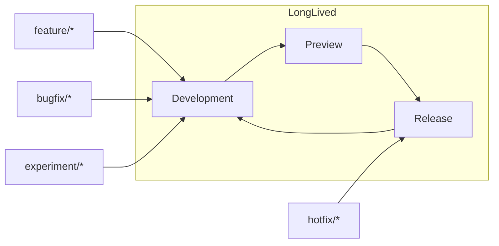
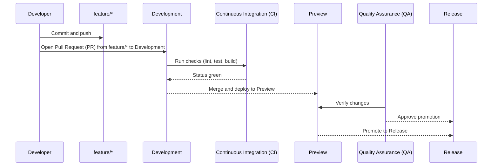

# 🌟 Guiding Principles
Habits that keep work safe, fast, and easy to change—use these as a review checklist.

1) **Ship small, reviewable changes**  
   Thin vertical slices get faster feedback and safer deploys.
   - ✅ **Do:** keep Pull Requests (PRs) focused on a single intent; favor < ~250 net Lines of Code (LOC); write clear titles/descriptions.
   - 🚫 **Avoid:** “kitchen-sink” Pull Requests (PRs), drive-by refactors, and mixing formatting with logic changes.

2) **Automate the boring & error-prone**  
   Make the happy path one command locally and in Continuous Integration (CI).
   - ✅ **Do:** enforce formatters/linters/tests as required checks; align local ≈ Continuous Integration (CI) via scripts/Makefile/containers.
   - 🚫 **Avoid:** manual release steps, snowflake environments, and “works on my machine” setups.

3) **Readable over clever**  
   Optimize for the next reader (including future you).
   - ✅ **Do:** name things well; keep functions small; comment the *why*; record decisions as Architecture Decision Records (ADRs).
   - 🚫 **Avoid:** cryptic abstractions, premature optimization, and hidden side effects.

4) **Security from the start**  
   Bake security into everyday work—don’t bolt it on later.
   - ✅ **Do:** keep secrets out of Git; use secret managers; least-privilege tokens; enable secret scanning and Software Composition Analysis (SCA); review dependencies regularly.
   - 🚫 **Avoid:** personal tokens in Continuous Integration (CI), sharing credentials, or postponing rotations and dependency fixes.

5) **Reproducible builds**  
   Anyone can build the same artifact and deploy it confidently.
   - ✅ **Do:** pin versions; commit lockfiles; build in Continuous Integration (CI); deploy the exact artifact you tested; tag releases; write changelogs.
   - 🚫 **Avoid:** laptop builds for production, floating `latest` tags, and environment-dependent outputs.

6) **Default to transparency**  
   Make context easy to find and decisions easy to audit.
   - ✅ **Do:** link issues/tickets in Pull Requests (PRs); explain risks/rollout; document exceptions; capture post-incident actions with owners and dates.
   - 🚫 **Avoid:** tribal knowledge, private silos, and silent process changes.

7) **Design for rollback and recovery**  
   Every change should be easy to turn off, back out, or repair.
   - ✅ **Do:** gate changes with feature flags; use canary/percentage rollouts; make database migrations reversible; keep prior artifacts ready to redeploy.
   - 🚫 **Avoid:** irreversible schema changes, destructive data operations without backups, and “all-or-nothing” releases.

8) **Observability first**  
   If you can’t see it, you can’t fix it.
   - ✅ **Do:** ship structured logs, metrics, and traces; define alerts tied to Service Level Objectives (SLOs); propagate correlation IDs across services.
   - 🚫 **Avoid:** debug-only logging, noisy non-actionable alerts, and silent failures.

9) **Documentation is a deliverable**  
   Docs reduce rework and speed onboarding.
   - ✅ **Do:** maintain README files, task-focused docs, and Architecture Decision Records (ADRs) close to code; update docs in the same Pull Request (PR).
   - 🚫 **Avoid:** stale pages, doc drift, and “will document later.”

10) **Clear ownership and accountability**  
    Unowned code becomes broken code.
    - ✅ **Do:** keep CODEOWNERS accurate; assign a Directly Responsible Individual (DRI) for key areas; use Role-Based Access Control (RBAC) appropriately.
    - 🚫 **Avoid:** ambiguous ownership, drive-by approvals, and unreviewed critical paths.

11) **Dependency & upgrade hygiene**  
    Third-party code is part of your system.
    - ✅ **Do:** pin versions; generate a Software Bill of Materials (SBOM); review licenses; apply regular updates with rate limits and batch windows.
    - 🚫 **Avoid:** unbounded Dependabot/renovate floods, abandoned packages, and ignoring transitive risks.

12) **Feature flags & gradual delivery**  
    Separate deploy from release.
    - ✅ **Do:** use flags for risky changes; roll out progressively; remove stale flags promptly; document flag ownership and kill-switches.
    - 🚫 **Avoid:** long-lived flags that become permanent logic branches, and big-bang global flips without safeguards.

### Flow of Code (Diagram)

---

## 🔗 See also
> [!IMPORTANT]
> The links below point to files in /docs/. If you rename or move a file, update every reference across the repo to prevent link drift.

### Introduction
Get set up quickly and understand how this repo is organized and why. This section orients new contributors, aligns everyone on our principles, and ensures your local environment matches what CI expects. By the end, you’ll know the repo layout, standards, and how to make your first safe change.

- [🎯 About This Repository](/README.md)
- [🚀 Project Initialization (Day 0)](/docs/introduction/%F0%9F%9A%80%20Project%20Initialization%20%28Day%200%29.md)
- [🛠️ Environment & Technologies](/docs/introduction/%F0%9F%9B%A0%EF%B8%8F%20Environment%20%26%20Technologies.md)
- [🌟 Guiding Principles](/docs/introduction/%F0%9F%8C%9F%20Guiding%20Principles.md)
- [🧠 GitHub Concepts Recap](/docs/introduction/%F0%9F%A7%A0%20GitHub%20Concepts%20Recap.md)

### Workflow
Show how code moves from idea to production through small, reviewable changes. This is our end-to-end flow: branch naming, commit habits (including AI assist), PR etiquette, CI gates, testing layers, and how we cut and version releases. Follow this to keep changes fast, traceable, and low-risk.

- [🌿 Branching Strategy & Workflow](/docs/distribution/%F0%9F%8C%BF%20Branching%20Strategy%20%26%20Workflow.md)
- [🤝 Pull Requests & Code Reviews](/docs/distribution/%F0%9F%A4%9D%20Pull%20Requests%20%26%20Code%20Reviews.md)
- [⚙️ Continuous Integration & Delivery](/docs/distribution/%E2%9A%99%EF%B8%8F%20Continuous%20Integration%20%26%20Delivery.md)
- [🧪 Testing Strategy](/docs/distribution/%F0%9F%A7%AA%20Testing%20Strategy.md)
- [🚢 Releases & Versioning](/docs/distribution/%F0%9F%9A%A2%20Releases%20%26%20Versioning.md)
- [🤖 AI-Driven Commit Process](/docs/distribution/%F0%9F%A4%96%20AI%E2%80%91Driven%20Commit%20Process.md)

### Operations
Keep the repository healthy over time. These practices harden security (branch protections, secret handling), reduce supply-chain risk (deps), and maintain repo quality (hygiene, troubleshooting). Use these docs when changing guardrails, rotating secrets, upgrading dependencies, or diagnosing issues in production pipelines.

- [🛡️ Branch Protection](/docs/operations/%F0%9F%9B%A1%EF%B8%8F%20Branch%20Protection.md)
- [🔐 Security & Secrets](/docs/operations/%F0%9F%94%90%20Security%20%26%20Secrets.md)
- [📦 Dependency Management](/docs/operations/%F0%9F%93%A6%20Dependency%20Management.md)
- [🧩 Repository Hygiene](/docs/operations/%F0%9F%A7%A9%20Repository%20Hygiene.md)
- [🧯 Troubleshooting](/docs/operations/%F0%9F%A7%AF%20Troubleshooting.md)

### References
Fast lookups you’ll reuse daily—keep these open in a tab. Commands and definitions that support the above processes without re-explaining the “why.” Use this section to unblock yourself quickly while working through Introduction, Workflow, or Operations.

- [⌨️ Git Commands](/docs/references/%E2%8C%A8%EF%B8%8F%20Git%20Commands.md)
- [📘 Glossary](/docs/references/%F0%9F%93%98%20Glossary.md)
